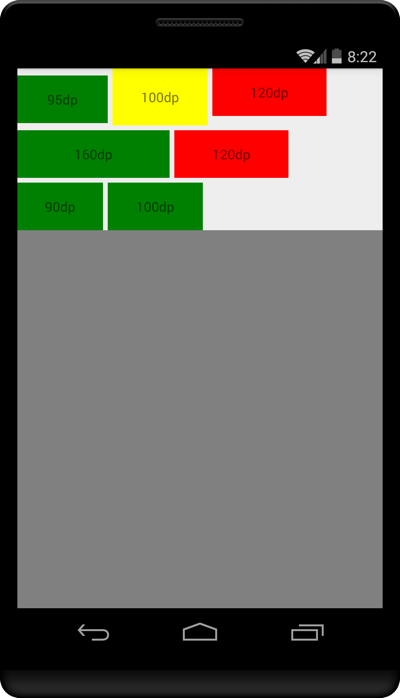

FilterFlowLayout
---

#### **含有过滤功能的流式布局**

[](https://maven-badges.herokuapp.com/maven-central/me.codeboy.android/filter-flow-layout)

参考[FlowLayout](https://github.com/blazsolar/FlowLayout)

- 可以去除宽度不在范围(比例或真实值)内的子view
- 可以设置最大行数
- 可以添加组件间水平间距
- 可以添加行间距



## 系统要求
Android 4.0以上

## 快速使用

build.gradle加入dependencies

    compile 'me.codeboy.android:filter-flow-layout:1.0.4'

引用布局

    <me.codeboy.android.filterflowlayout.FilterFlowLayout
        xmlns:cb="http://schemas.android.com/apk/res-auto"
        android:id="@+id/filterFlowLayout"
        android:layout_width="match_parent"
        android:layout_height="wrap_content"
        cb:maxWidthRatio="0.5"
        cb:minWidth="80dp"
        cb:maxLines="3"
        cb:horizontalGap="5dp"
        cb:verticalGap="5dp"
        >

- 最大宽度为FlowLayout的宽度的一半
- 最小宽度是80dp
- 最大行数为3行
- 水平间距为5dp
- 垂直间距为5dp

## xml配置
    maxWidthRatio  最大宽度比例，相对于FlowLayout的总宽度，默认-1
    minWidthRatio  最小宽度比例，相对于FlowLayout的总宽度，默认-1
    maxWidth       最大宽度,默认0
    minWidth       最小宽度，默认0
    maxLines       最大显示行数，默认Integer.MAX_VALUE
    horizontalGap  每一行子试图之间的空隙，默认是0
    verticalGap    多行式行空隙，默认是0


## 相关方法

    setMaxChildWidth(float maxChildWidth)  //设置最大宽度
    setMinChildWidth(float minChildWidth)  //设置最小宽度
    setMaxLines(int maxLines)              //设置最大行数
    setHorizontalGap(int horizontalGap)    //设置水平间距
    setVerticalGap(int verticalGap)        //设置垂直间距


## 注意事项

- xml中同时设置宽度的比例与具体值时，比例(ratio)的优先级高于真实值。
- 宽度都不设置时，最大宽度为FlowLayout的宽度


## License

```
Copyright 2016 Yuedong.li

Licensed under the Apache License, Version 2.0 (the "License");
you may not use this file except in compliance with the License.
You may obtain a copy of the License at

   http://www.apache.org/licenses/LICENSE-2.0

Unless required by applicable law or agreed to in writing, software
distributed under the License is distributed on an "AS IS" BASIS,
WITHOUT WARRANTIES OR CONDITIONS OF ANY KIND, either express or implied.
See the License for the specific language governing permissions and
limitations under the License.
```

> 有任何问题,欢迎发送邮件到app@codeboy.me交流.s
